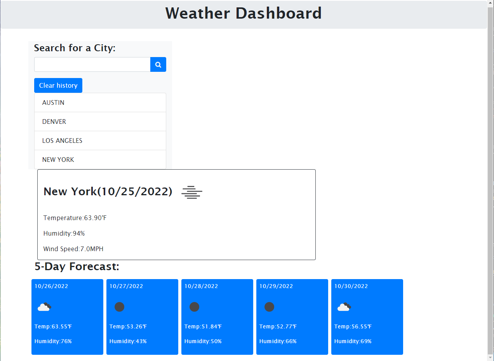

# Weather-Dashboard

A Repository for a weather dashboard built during the bootcamp at UTA, this project utilizes a weather forecast API as well as dynamically updated HTML and CSS.

## Table of Contents ##

* [Description](#description)
    
* [Usage](#usage)
    
* [Mock-Up](#mock-up)
    
* [Link to Application](#link_to_application)
    

## Description ##

A Repository for a weather dashboard built during the bootcamp at UTA, this project utilizes a weather forecast API as well as dynamically updated HTML and CSS.

### Usage ###

Click the URL link below to visit the application. Input a city name to view the current weather forecast and the 5-day forecast. This will also save that city to the local storage so the user can click that listed city instead of having to retype the city again. Click the Clear History button to clear the local storage of cities.

### Mock-Up ###

### Link To Application ###

[Application-Link] 

